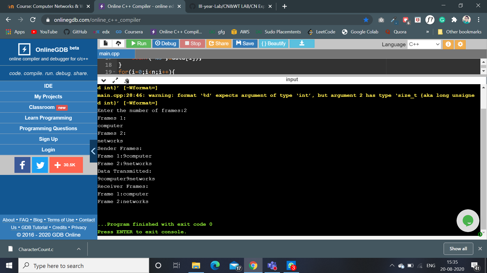

# Experment 1
## Aim
to implement data link layer framing techniques such as 
i.char count ii.char stuffing iii.bit stuffing
### Procedure for Character Count
1. First scan the number of frames required.
2. Scan the frames.
3. Find string length of each frames
4. Print the Frames at Sender.
5. Print  the Data Transmitted.
6. Print the frames at Receiver.

#### Output

