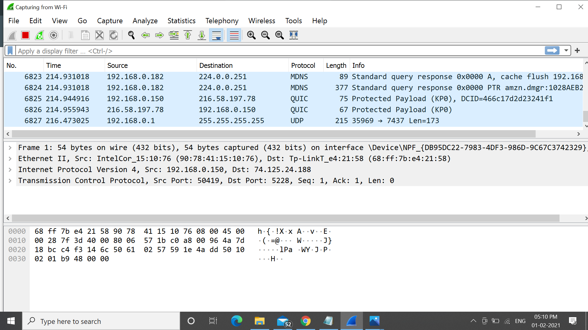
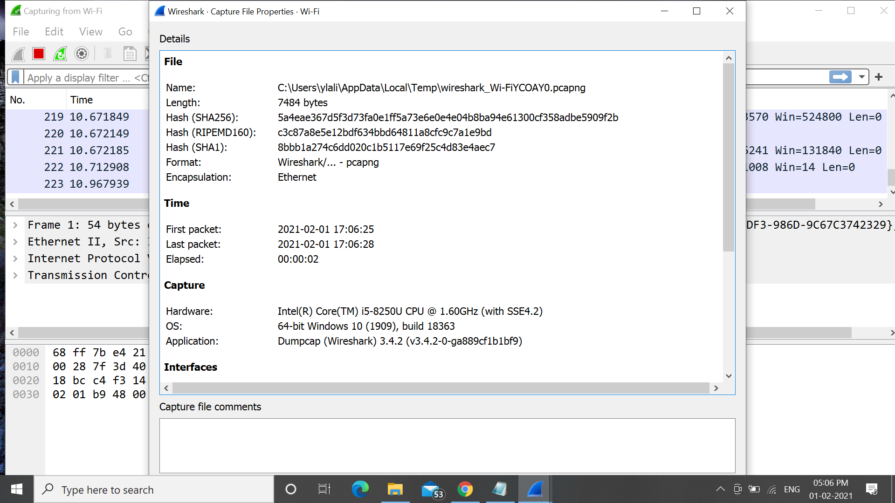
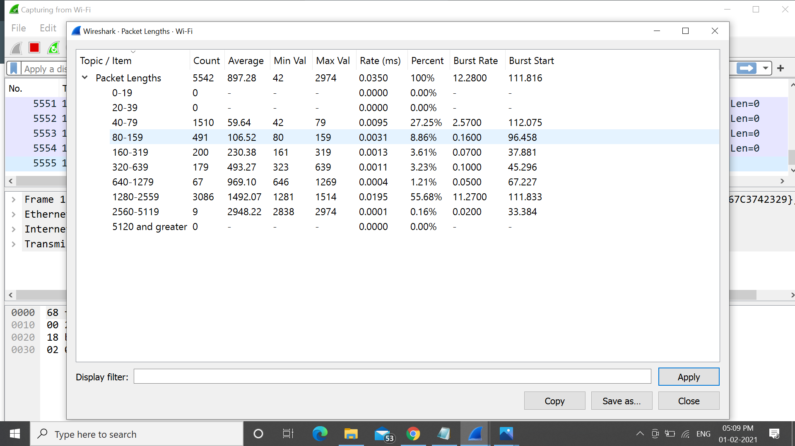
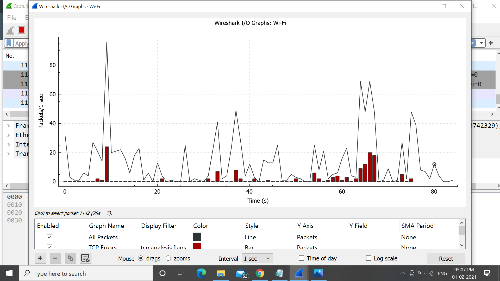

# Experimet 10
# Aim of the Experiment
## Aim: To perform the following using Wireshark 

### 1. Packet Capture Using Wireshark

### 2. Starting Wireshark

### 3. Viewing Captured Traffic

### 4. Analysis and Statistics & Filters.

# Steps or Procedure of experiment
1.Download and install wireshark

2.Open wireshark

3.Capture the packet (choose either Ethernet or Wifi).

4.Wireshark starts then stop and choose a filter and start the wireshark.

5.This displays complete details such as source address,destination address and port.

6.Click on Analysis button to know the analysis of filter captured.

7.Click on statistics and choose Capture file statistics,packet lengths,I/O graphs.

## Output
### Starting Wire shark and viewing captured Traffic

## Analysis and statistics
### Captured file statistics

### Packet Lengths

### I/O graphs

